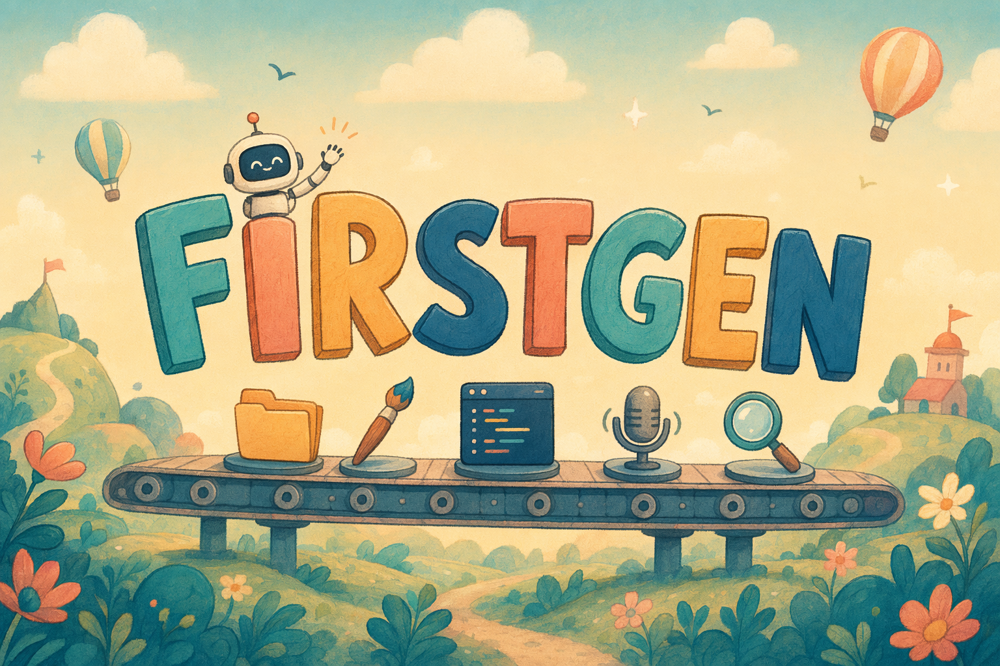

# 🚀 FirstGen — Sutton Trust × Microsoft Workplace Safari

Welcome! You're part of a team building **FirstGen** — a marketing microsite for a (fictional) social enterprise that helps first-generation university students.

> **You have ~40 minutes. Don't panic. AI is doing the heavy lifting — your job is to direct it.**

---

## The brief, in 60 seconds

**FirstGen** is a website that helps people who are *the first in their family to go to university*. It connects them with current undergraduates from similar backgrounds, and points them to practical resources — how student finance actually works, what to do in freshers' week, how to ask a tutor for help, how to budget when the maintenance loan lands in one lump sum.

**FirstGen does not exist yet.** Your team is building the **marketing microsite** that will launch it. The audience is UK sixth-formers and college students (16–18) who are about to apply to university and are wondering whether it's really for *people like them*.

What goes on the site, what it says and how it feels — your team decides.

---

## Your role card

You were handed a card on the way in. It tells you:

- The role you're contributing as — **Project Coordinator**, **Software Developer**, **Copywriter**, **Visual Designer**, **Pitch Lead**, **Accessibility Champion**, or **Researcher**.
- The accounts (GitHub + Microsoft Copilot) that have been set up for you.
- A quick "first 2 minutes" plan to get you moving.
- Prompts that work well for your role.

Multiple people may have the same role — that's intentional. **Treat your role-mates as a team**, not as competitors. Agree quickly who's covering what and dive in.

---

## How to commit your work (no Git knowledge needed)

1. Go to **github.com** and sign in with the email + password on your role card.
2. Open this repository (the URL is on your card).
3. Click into your role's folder under `contributions/`.
4. Click **Add file → Upload files** (for images or finished files) or **Add file → Create new file** (for text, code, notes).
5. At the bottom: type a short message like *"Hero headline ideas"* and click **Commit changes**.
6. **That's it.** The big screen at the front of the room will show your work appearing.

You can commit as many times as you like. **Earlier and more often is better** — the Factory Agent on the screen keeps integrating everything as it lands.

> **🚧 One important rule:** You write only into your own role folder under `contributions/`. The `/site/` folder is owned by the **Factory Agent** — that's the AI on the big screen. It reads what you commit and stitches the live FirstGen site together. Don't worry about breaking anything: the Agent is the only thing that touches `/site/`.

---

## How contributions become the site

The actual site lives in `/site/` and is **built live by the Factory Agent**. You'll watch it taking shape on the big screen as your team commits.

You don't edit `/site/` directly. You contribute to your role folder, and the Agent reads, reasons about placement, and weaves your work in.

- **Software Developers** — write HTML/CSS *proposals* into your folder: palette ideas, layout sketches, component snippets, refactor requests, polish notes. The Agent reshapes the page from those proposals.
- **Visual Designers** — drop image files (`hero.png`, portraits, dividers, secondary images, closing image). The Agent picks them up and slots them where they fit.
- **Copywriters** — drop `.md` files with copy: headlines, body, microcopy, alternative drafts. The Agent picks the strongest version for each section and weaves in others where they strengthen the page.
- **Researchers** — drop `stats.md` and `quotes.md` with sources. Copywriters and the Pitch Lead lean on these.
- **Accessibility Champions** — drop `audit.md` with findings + suggested fixes. The Agent applies them.
- **Pitch Leads** — drop a `pitch.md` or `closing-line.md` shaping the team's story.
- **Project Coordinator** — drop `team-plan.md` and `flow-notes.md` early. That's the brief the Agent uses to decide section order and emphasis.

When more than one person shares your role, **all your work is fair game** — the Agent picks one clear primary version per section and credits the rest in the closing "Built by" block, so no one gets hidden on stage.

---

## What happens at the end

- **Around minute 48–50:** Quick "stop & admire" — the team looks together at what the Factory Agent has built.
- **Around minute 50–53:** A short team showcase — the Pitch Lead helps narrate, with the team alongside. The live FirstGen microsite renders on the screen behind you.
- **Around minute 53–60:** Anyone who wants to shares one thing they learned.

No solo performances expected — the team built it, the team owns it.

---

## A few things worth remembering

- **Every commit is celebrated.** The screen never criticises. Whatever you ship, it lands.
- **Help each other.** Especially Project Coordinator ↔ everyone, and Copywriter ↔ Designer ↔ Developer.
- **Use AI as a colleague, not an oracle.** Ask it three times, pick the best answer, push back when it's bland.
- **Have fun.** This is supposed to be excellent. 🌟

---

*Built for the Sutton Trust × Microsoft Workplace Safari. Run by Jarrod Krige (Partner Solution Architect) with James Bishop. Inspired by the Sutton Trust's mission of social mobility through opportunity.*
